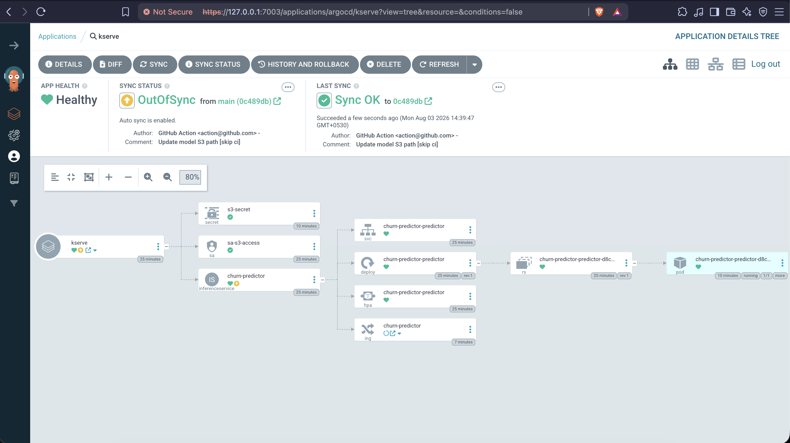

# Customer Churn Prediction - Production MLOps Pipeline

A production-ready, end-to-end MLOps pipeline demonstrating automated machine learning workflows with modern DevOps practices, GitOps deployment, and scalable model serving on Kubernetes.

## Table of Contents

- [Overview](#overview)
- [Key Features](#key-features)
- [Architecture](#architecture)
- [Technology Stack](#technology-stack)
- [Project Structure](#project-structure)
- [Setup and Installation](#setup-and-installation)
- [CI/CD Pipeline](#cicd-pipeline)
- [Model Deployment](#model-deployment)
- [API Usage](#api-usage)
- [Monitoring and Observability](#monitoring-and-observability)
- [Troubleshooting](#troubleshooting)
- [Best Practices](#best-practices)
- [Contributing](#contributing)
- [License](#license)

---

## Overview

This project implements a **customer churn prediction model** deployed on Kubernetes using **KServe** for scalable, production-grade inference. The pipeline showcases modern MLOps practices for continuous delivery of machine learning models.

### Key Features

- ✅ **Automated ML Pipeline**: End-to-end automation from data generation to model deployment
- ✅ **Version Control**: Data versioning with DVC, code with Git
- ✅ **CI/CD Automation**: GitHub Actions for continuous integration and deployment
- ✅ **Model Serving**: KServe on Kubernetes for scalable inference
- ✅ **GitOps Deployment**: ArgoCD for declarative, automated deployments
- ✅ **Cloud Integration**: AWS S3 for model artifact storage
- ✅ **Infrastructure as Code**: All Kubernetes resources defined declaratively

### What Does This Model Do?

The model predicts which customers are likely to cancel their subscription (churn) based on behavioral patterns.

**Example Input:**
```json
{
  "age": 45,
  "tenure_months": 24,
  "monthly_charges": 79.99,
  "total_charges": 1920.00,
  "num_support_calls": 3
}
```

**Model Output:**
```json
{
  "churn": 1,
  "churn_probability": 0.73
}
```

This indicates a 73% probability that the customer will churn. The model identifies patterns such as:
- High monthly charges
- Frequent support calls (customer frustration)
- Low tenure (limited loyalty)

**Business Value:** Enables proactive customer retention through targeted interventions before churn occurs.

---

## Architecture

```
┌─────────────────┐
│  GitHub Repo    │
│  - Code         │
│  - K8s Manifests│
└────────┬────────┘
         │
         │ Push to main
         ▼
┌─────────────────────────────────┐
│   GitHub Actions (CI/CD)        │
│  1. Generate synthetic data     │
│  2. Train model                 │
│  3. Upload model to S3          │
│  4. Update K8s manifests        │
└────────┬────────────────────────┘
         │
         │ Commit updated manifests
         ▼
┌─────────────────────────────────┐
│         ArgoCD                   │
│  - Monitors Git repo            │
│  - Syncs K8s resources          │
│  - Manages deployments          │
└────────┬────────────────────────┘
         │
         │ Deploy
         ▼
┌─────────────────────────────────┐
│   Kubernetes Cluster            │
│  ┌──────────────────────────┐  │
│  │     KServe               │  │
│  │  - InferenceService      │  │
│  │  - Storage Initializer   │  │
│  │  - SKLearn Server        │  │
│  └──────────────────────────┘  │
└────────┬────────────────────────┘
         │
         │ Fetch model
         ▼
┌─────────────────┐
│   AWS S3        │
│  churn_model.pkl│
└─────────────────┘
```

---

## Technology Stack

| Component | Technology |
|-----------|------------|
| **ML Framework** | scikit-learn |
| **Model Serving** | KServe v0.19.0 |
| **Container Orchestration** | Kubernetes (kind) |
| **CI/CD** | GitHub Actions |
| **GitOps** | ArgoCD |
| **Data Versioning** | DVC |
| **Cloud Storage** | AWS S3 |
| **API Framework** | FastAPI (local testing) |
| **Programming Language** | Python 3.11 |

---

## Project Structure

```
.
├── .github/
│   └── workflows/
│       └── mlops_pipeline.yml    # CI/CD pipeline configuration
├── k8s/
│   ├── inference.yml             # KServe InferenceService manifest
│   └── serviceacc.yml            # Service account and S3 secret
├── data/
│   ├── churn_data.csv            # Training dataset (DVC tracked)
│   └── churn_data.csv.dvc        # DVC metadata
├── models/
│   └── churn_model.pkl           # Trained model (gitignored)
├── .dvc/
│   └── config                    # DVC S3 remote configuration
├── generate_data.py              # Synthetic data generation script
├── train.py                      # Model training script
├── api.py                        # FastAPI local inference server
├── requirements.txt              # Python dependencies
└── README.md                     # Project documentation
```

---

## Setup and Installation

### Prerequisites

- Python 3.11+
- Kubernetes cluster (kind, minikube, or cloud-based)
- kubectl configured
- AWS CLI configured
- DVC installed
- ArgoCD installed on cluster

### Local Development Setup

1. **Clone the repository:**
   ```bash
   git clone <repository-url>
   cd Realtime-MLOps-Project
   ```

2. **Install Python dependencies:**
   ```bash
   pip install -r requirements.txt
   ```

3. **Pull data from DVC:**
   ```bash
   dvc pull
   ```

4. **Generate synthetic data (if needed):**
   ```bash
   python generate_data.py
   ```

5. **Train the model:**
   ```bash
   python train.py
   ```

6. **Test API locally:**
   ```bash
   python api.py
   # Visit http://localhost:8000/docs for Swagger UI
   ```

### Kubernetes Deployment Setup

1. **Create namespace:**
   ```bash
   kubectl create namespace ml
   ```

2. **Configure AWS S3 credentials:**
   ```bash
   kubectl create secret generic s3-secret -n ml \
     --from-literal=AWS_ACCESS_KEY_ID=<your-access-key> \
     --from-literal=AWS_SECRET_ACCESS_KEY=<your-secret-key>
   
   kubectl annotate secret s3-secret -n ml \
     serving.kserve.io/s3-endpoint=s3.amazonaws.com \
     serving.kserve.io/s3-region=us-east-1 \
     serving.kserve.io/s3-usehttps=1
   ```

3. **Apply Kubernetes manifests:**
   ```bash
   kubectl apply -f k8s/serviceacc.yml
   kubectl apply -f k8s/inference.yml
   ```

4. **Verify deployment:**
   ```bash
   kubectl get pods -n ml
   kubectl get inferenceservice -n ml
   ```

---

## CI/CD Pipeline

The GitHub Actions workflow (`mlops_pipeline.yml`) automates the entire ML lifecycle:

### Pipeline Stages

1. **Data Generation**
   - Generates synthetic churn dataset
   - Ensures reproducibility

2. **Model Training**
   - Trains scikit-learn classifier
   - Saves model to `models/churn_model.pkl`

3. **Model Upload**
   - Pushes trained model to S3 bucket
   - Location: `s3://churn-model-bucket-cicd-sumeet02/models/churn_model.pkl`

4. **Manifest Update**
   - Updates `k8s/inference.yml` with new model path
   - Commits changes back to repository

5. **ArgoCD Sync**
   - ArgoCD detects manifest changes
   - Automatically deploys updated InferenceService

### Trigger

```bash
# Automatic trigger on push to main
git push origin main

# Manual trigger via GitHub UI
# Actions tab > MLOps Pipeline > Run workflow
```

### Required Secrets

Configure these in GitHub repository settings:

- `AWS_ACCESS_KEY_ID`
- `AWS_SECRET_ACCESS_KEY`

---

## Model Deployment

### ArgoCD GitOps Workflow

ArgoCD continuously monitors the Git repository and synchronizes the Kubernetes cluster state with the declared manifests.

#### ArgoCD Application Configuration

```
Application: churn-predictor
Project: default
Repository: <your-git-repo>
Path: k8s/
Destination: ml namespace
Sync Policy: Automatic
```

**ArgoCD Application UI:**



*ArgoCD application showing the resource tree with InferenceService, Pods, Services, and their health status*

---

Check deployment status:
```bash
kubectl get inferenceservice churn-predictor -n ml
```

Expected output:
```
NAME              URL                                      READY   PREV   LATEST   AGE
churn-predictor   http://churn-predictor.ml.example.com   True    100                 5m
```

---

## API Usage

### Access the Model

1. **Port-forward the service:**
   ```bash
   kubectl port-forward svc/churn-predictor-predictor -n ml 8080:80 --address 0.0.0.0
   ```

2. **Send prediction request:**
   ```bash
   curl -X POST http://localhost:8080/v1/models/churn-predictor:predict \
     -H "Content-Type: application/json" \
     -d '{
       "instances": [
         {
           "age": 45,
           "tenure_months": 24,
           "monthly_charges": 79.99,
           "total_charges": 1920.00,
           "num_support_calls": 3
         }
       ]
     }'
   ```

3. **Response:**
   ```json
   {
     "predictions": [1, 0.73]
   }
   ```

### KServe Prediction Protocol

KServe uses the V1 inference protocol. The request format is:

```json
{
  "instances": [
    [age, tenure_months, monthly_charges, total_charges, num_support_calls]
  ]
}
```

---

## Monitoring and Observability

### Deployment Health

Monitor the health of your KServe deployment:

```bash
# Check InferenceService status
kubectl get inferenceservice churn-predictor -n ml

# Watch pod status
kubectl get pods -n ml -w

# Check service endpoints
kubectl get svc -n ml
```

### Logs and Debugging

```bash
# View predictor logs
kubectl logs -n ml -l serving.kserve.io/inferenceservice=churn-predictor -c kserve-container

# View storage initializer logs (for S3 issues)
kubectl logs -n ml -l serving.kserve.io/inferenceservice=churn-predictor -c storage-initializer

# Describe InferenceService for events
kubectl describe inferenceservice churn-predictor -n ml
```

### ArgoCD Monitoring

Monitor deployments through ArgoCD UI:

1. **Access ArgoCD UI:**
   ```bash
   kubectl port-forward svc/argocd-server -n argocd 8080:443
   ```
   Navigate to: `https://localhost:8080`

2. **Check Application Health:**
   - Green: All resources healthy and synced
   - Yellow: Progressing or out of sync
   - Red: Degraded or failed

3. **View Sync History:**
   ```bash
   argocd app history churn-predictor
   ```

### Model Performance Monitoring

For production deployments, consider integrating:
- **Prometheus**: Metrics collection from KServe
- **Grafana**: Visualization of inference metrics
- **Evidently AI**: Model drift detection
- **MLflow**: Experiment tracking and model registry

---

## Troubleshooting

### Pod in CrashLoopBackOff

**Issue:** Init container fails with S3 403 Forbidden error

**Cause:** Invalid or missing AWS credentials in the `s3-secret`

**Solution:**
```bash
# Delete old secret
kubectl delete secret s3-secret -n ml

# Create new secret with valid credentials
kubectl create secret generic s3-secret -n ml \
  --from-literal=AWS_ACCESS_KEY_ID=<valid-key> \
  --from-literal=AWS_SECRET_ACCESS_KEY=<valid-secret>

# Add required annotations
kubectl annotate secret s3-secret -n ml \
  serving.kserve.io/s3-endpoint=s3.amazonaws.com \
  serving.kserve.io/s3-region=us-east-1 \
  serving.kserve.io/s3-usehttps=1

# Restart pod
kubectl delete pod -n ml -l serving.kserve.io/inferenceservice=churn-predictor
```

### Check Pod Logs

```bash
# Init container logs
kubectl logs <pod-name> -n ml -c storage-initializer

# Main container logs
kubectl logs <pod-name> -n ml -c kserve-container

# Describe pod for events
kubectl describe pod <pod-name> -n ml
```

### Verify S3 Access

```bash
# Test S3 bucket access
aws s3 ls s3://churn-model-bucket-cicd-sumeet02/

# Check model file
aws s3 ls s3://churn-model-bucket-cicd-sumeet02/models/
```

### ArgoCD Sync Issues

```bash
# Check ArgoCD application status
argocd app get churn-predictor

# Force sync
argocd app sync churn-predictor

# View sync history
argocd app history churn-predictor
```

---

## Best Practices

### Security

1. **Secrets Management:**
   - Never commit AWS credentials to Git
   - Use Kubernetes secrets for sensitive data
   - Rotate credentials regularly
   - Use IAM roles for pods in production (AWS EKS IRSA)

2. **Model Access Control:**
   - Implement authentication for inference endpoints
   - Use network policies to restrict pod communication
   - Enable TLS for external traffic

### Model Versioning

1. **Track Model Lineage:**
   - Include training timestamp in model artifacts
   - Tag S3 objects with metadata (git commit, accuracy metrics)
   - Maintain model registry for production deployments

2. **Rollback Strategy:**
   - Keep previous model versions in S3
   - Use ArgoCD history for quick rollbacks
   - Test models in staging before production

### Pipeline Optimization

1. **Efficient Training:**
   - Cache dependencies in CI/CD
   - Use data validation before training
   - Implement early stopping for faster iterations

2. **Resource Management:**
   - Set resource limits on InferenceService pods
   - Use horizontal pod autoscaling for high traffic
   - Monitor S3 costs and implement lifecycle policies

### GitOps Workflow

1. **Separation of Concerns:**
   - Keep application code separate from Kubernetes manifests
   - Use separate repositories for infrastructure and application (optional)
   - Implement branch protection for production deployments

2. **Automated Testing:**
   - Add model validation tests in CI/CD
   - Test inference endpoint health after deployment
   - Implement smoke tests for critical features

---

## Contributing

Contributions are welcome! Please follow these guidelines:

1. Fork the repository
2. Create a feature branch (`git checkout -b feature/amazing-feature`)
3. Commit your changes (`git commit -m 'Add amazing feature'`)
4. Push to the branch (`git push origin feature/amazing-feature`)
5. Open a Pull Request

### Development Guidelines

- Follow PEP 8 style guide for Python code
- Add unit tests for new features
- Update documentation for significant changes
- Test changes locally before submitting PR

---

## License

This project is licensed under the MIT License - see the LICENSE file for details.

**Note:** This project is primarily for educational and demonstration purposes.

---

## Acknowledgments

- Built with [KServe](https://kserve.github.io/website/) for model serving
- Deployed using [ArgoCD](https://argoproj.github.io/cd/) for GitOps
- Data versioning with [DVC](https://dvc.org/)

---

## Contact

For questions, suggestions, or support:
- Open an issue in the repository
- Reach out via GitHub Discussions

---

**Made with ❤️ for the MLOps Community**
